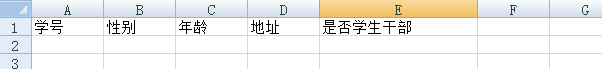

# ExcelUtil

Excel 导入导出工具

## 目录

1. 导出


## 导出

### 配置模版


### 定义 Java 对象

```java
package com.smlf.excel.test.model;

import com.smlf.excel.annotation.DataField;
import com.smlf.excel.annotation.Dataset;

@Dataset(sheetName="学生")
public class Student {
	
	@DataField(columnIndex = 0)
	private String name;
	
	@DataField(columnIndex = 1)
	private String sex;
	
	@DataField(columnIndex = 2)
	private int age;
	
	@DataField(columnIndex = 3)
	private String address;
	
	@DataField(columnIndex = 4)
	private boolean isCadres;

	public String getName() {
		return name;
	}

	public void setName(String name) {
		this.name = name;
	}

	public String getSex() {
		return sex;
	}

	public void setSex(String sex) {
		this.sex = sex;
	}

	public int getAge() {
		return age;
	}

	public void setAge(int age) {
		this.age = age;
	}

	public String getAddress() {
		return address;
	}

	public void setAddress(String address) {
		this.address = address;
	}

	public boolean isCadres() {
		return isCadres;
	}

	public void setCadres(boolean isCadres) {
		this.isCadres = isCadres;
	}

}


```

### 导出

ExportUtil.export(workbook, 0, 1, list);

参数说明 workbook 表示工作簿 ， 0表示sheet索引 ， 1 表示数据开始行索引 list表示数据列表